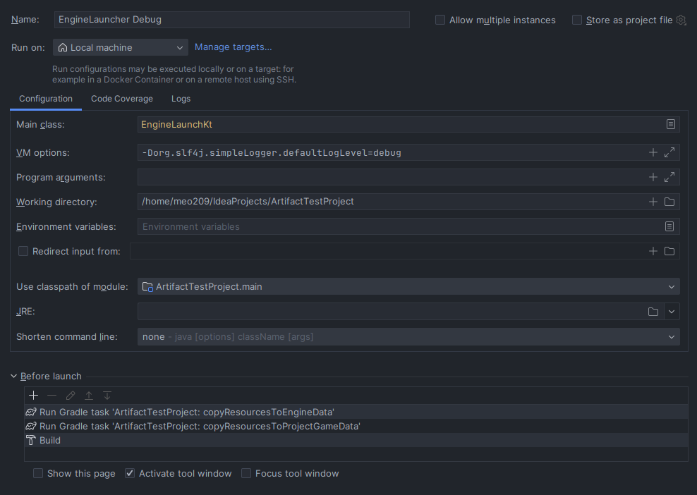

# Artifact Test Project

A test project for the [Artifact Game Engine](https://www.github.com/meo209/Artifact).

Setting it up requires Java 8+, Kotlin and the Artifact Engine to be downloaded.

The folder structure should look like this:

```
IdeaProjects
 - Artifact
  - src
  - gradle
 - ArtifactTestProject
  - src
  - gradle
```

The [settings.gradle.kts](settings.gradle.kts) must contain:
```kotlin
includeFlat("Artifact")
```

Running the project requires creating a run configuration like this:



Make sure to add the "copyResourcesToGameData" gradle task **before** the build task.

If using the debug level, add the following to the VM options:
```
-Dorg.slf4j.simpleLogger.defaultLogLevel=debug 
```

# License
[GPLv3](https://www.gnu.org/licenses/gpl-3.0.html)